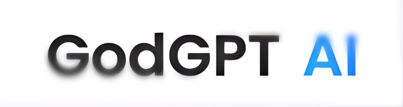
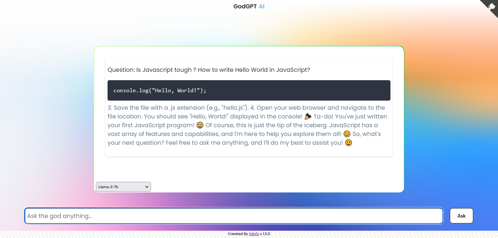

<p align="center">
  <a href="https://godgpt.chatnaut.com/">
    
  </a>
</p>

<h2 align="center">GodGPT AI: Get instant answers, discover creative inspiration, and gain new knowledge. </h2>
<p align="center">No Signin, No Signups, No BS, Just open to all.</p></br>
<h2 align="center"> <a href="https://godgpt.chatnaut.com/"> LIVE
  </a></h2>
</br>


https://github.com/S4nfs/GodGPT/assets/75138345/2658976d-aff9-48c8-807f-b1d320df551f

</br>
<p align="center">
  </br></br>
</p>

</br></br>

## ✨ AI Models released + scheduled
 -  Llama-2-7b (released)
  -  Llama-2-13b (released)
 -  Neural-chat-7b (released)
 -  Mistral-7b-instruct (released)
 -  Zephyr-7b (released)
 -  Qwen1.5-14b (scheduled)
 -  Qwen1.5-0.5b-chat (scheduled)
 -  Llamaguard-7b-awq  (scheduled)
 -  Tinyllama-1.1b (scheduled)
 -  Falcon-7b-instruct (scheduled)
 -  Phi-2 (scheduled)
 -  Bart-large (scheduled)
 -  Llama-2-70b-base (scheduled)
 -  GPT-4 Turbo (scheduled)
    </br></br>
    </br></br>

## 🏁 A little about The project
 -  I was feeling somewhat bored and working on another project while I was looking for was the most effective yet cheapest fine-tuned LLM models that would support function calls for production. After trying all the models, i came up with the idea of ​​centrally testing the performance of these models in one place, so i started building GodGPT in two days. This project is still unfinished and has some bugs and unimplemented features. For example, chat history, clipboard, authentication features, etc. are missing.  Also, I'm not a huge fan of frontends, but I did my best to make the UI beautiful (*AI itself centered that ```div``` 😉).  The end code will be uploaded soon. Also, I am planning to build a fully scaled version of GodGPT with next js & other developer friendly features (raise an issue what you want), but there is no confirmed business model for these chatGPTs yet and there are tons available out there looking for funding. It will be available for free unless it exceeds the server costs or attacked by bots. 

## 🐛 Known Bugs
- Text streaming is avoided as its keep failing to identify the code response in text, will get fixed in the next version.
- ~~No formatting of chat responses~~.
- Some models (Falcon-7b) are giving unknown names and awkward responses 👀.

## 👨‍💻 License

GodGPT is open-source, licensed as GPL v3.

## 👋 Contribution
The code is currently unavailable due to security issues. Please give me feedback by raising an issue on how you are using GodGPT and what I can add or improve.

